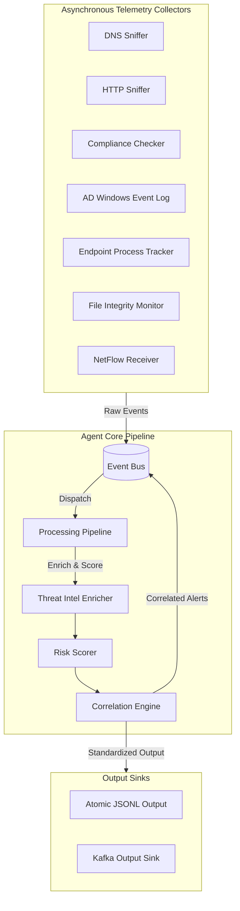

# DeepCytes DNS Security Agent & SOC Telemetry Pipeline

An advanced, real-time Security Operations Center (SOC) telemetry collection agent designed to capture DNS traffic (live or simulation mode), perform real-time correlation and security heuristic analysis, route threat indicators via Apache Kafka, and visualize telemetry metrics through an interactive Web GUI Dashboard.

---

## 1. Project Architecture Summary

The pipeline is split into three main tiers:
1. **Collection & Analysis (Agent)**: 
   - Uses Scapy to sniff DNS requests on local network interfaces (or generates traffic in simulation mode).
   - Core correlation engine runs heuristic checks (DGA detection, DNS tunneling, low TTL analysis, and typosquatting detection) against local threat feeds.
   - Saves final logs locally in JSON Lines (NDJSON) format under `logs/dns_soc_events.json`.
2. **Streaming Broker (Kafka)**:
   - Routes telemetry events asynchronously based on threat severity.
   - **`dns-events-raw`**: Receives all normal / benign DNS events.
   - Uses the queried `domain` as the partition key to guarantee chronological sequence mapping inside partitions.
3. **Visualization (Web GUI Dashboard)**:
   - A lightweight multithreaded web server that reads `logs/dns_soc_events.json` in real time.
   - Visualizes live KPI stats, provides audio alarms via browser-synthesized beeps, and allows analysts to click rows to expand the full deep JSON payloads.

---

## 🏛️ Architecture Overview

The agent consists of multiple asynchronous collectors that stream events into an in-memory `EventBus`. Events are processed by a `ProcessingPipeline`, enriched with threat intelligence, correlated across modules in real-time by a `CorrelationEngine`, and published to local output sinks (atomic rotating JSONL logs) and remote **Kafka** broker queues.

The agent consists of multiple asynchronous collectors that stream events into an in-memory `EventBus`. Events are processed by a `ProcessingPipeline`, enriched with threat intelligence, correlated across modules in real-time by a `CorrelationEngine`, and published to local output sinks (atomic rotating JSONL logs) and remote **Kafka** broker queues.



---

## 📁 Project Directory Structure

```
.
├── .gitignore
├── DeepCytes_SOC_Agent.spec
├── README.md
├── SOC_Agent.spec
├── TEAM5/
│   ├── .gitignore
│   ├── BACKUP/
│   │   └── KAFKA 2.0/
│   │       └── CyberSOC/
│   │           └── Team5/
│   │               └── main.py
│   ├── DNS EVENTS-CODE FOR ALL FILES WITH DIRECTORY STRUCTURE.docx
│   ├── DNS_SOC_Analyst_Visualizations.docx
│   ├── DeepCytes_DNS_Agent_Formal_Documentation.docx
│   ├── DeepCytes_DNS_Agent_SourceCode.docx
│   ├── EXPLANATION OF ALL CODES.docx
│   ├── FLOWCHART OF THE ARCHITECTURE OF THE DNS SYSTEM.excalidraw
│   ├── KAFKA ARCHIETCTURE OF ENTIRE PROJECT EXCALIDRAW.png
│   ├── LIST OF DATA POINTD FOR TEAM 5.docx
│   ├── README.md
│   ├── SOC_Telemetry_Kafka_Integration_Answers.docx
│   ├── SOC_Telemetry_Kafka_Integration_Pipeline_Design.docx
│   ├── TEAM 5 Test_Scenario_Document.docx
│   ├── collectors/
│   │   ├── __init__.py
│   │   └── dns_sniffer.py
│   ├── config.py
│   ├── dashboard.py
│   ├── engine/
│   │   ├── __init__.py
│   │   ├── correlation.py
│   │   ├── historical_tracker.py
│   │   └── tunneling_detector.py
│   ├── enrichers/
│   │   ├── __init__.py
│   │   ├── asset_enricher.py
│   │   ├── geoip_enricher.py
│   │   ├── threat_intel.py
│   │   ├── web_content_enricher.py
│   │   └── whois_enricher.py
│   ├── exe_commands.txt
│   ├── generate_code_docx.py
│   ├── generate_docx.py
│   ├── generate_formal_doc.py
│   ├── generate_soc_answers.py
│   ├── generate_soc_docx.py
│   ├── kafka_integration_diagram.png
│   ├── kafka_system_documentation.md
│   ├── main.py
│   ├── register_task.ps1
│   ├── requirements.txt
│   ├── soc_kafka_implementation_plan.md
│   ├── utils/
│   │   ├── __init__.py
│   │   ├── dga.py
│   │   ├── entropy.py
│   │   ├── kafka_producer.py
│   │   └── typosquat.py
│   └── walkthrough.md
├── TEAM6&7/
├── TEAM8/
├── __init__.py
├── __main__.py
├── alerts/
│   └── alerts.jsonl
├── config.yaml
├── data/
│   ├── ad_state.json
│   ├── events.db
│   ├── http_events.offset
│   └── plugins/
├── deepcytes_soc_agent/
│   ├── README.md
│   ├── __init__.py
│   ├── agents/
│   │   ├── __init__.py
│   │   └── orchestrator.py
│   ├── alerts/
│   │   ├── __init__.py
│   │   └── alert_engine.py
│   ├── analytics/
│   │   ├── __init__.py
│   │   ├── dga.py
│   │   ├── tunneling_detector.py
│   │   ├── typosquat.py
│   │   └── web_content_analyzer.py
│   ├── api/
│   │   ├── __init__.py
│   │   └── server.py
│   ├── collectors/
│   │   ├── __init__.py
│   │   ├── ad_collector.py
│   │   ├── base_collector.py
│   │   ├── compliance_collector.py
│   │   ├── compliance_impl.py
│   │   ├── dns_collector.py
│   │   ├── dns_sniffer_impl.py
│   │   ├── endpoint_collector.py
│   │   ├── file_integrity_collector.py
│   │   ├── http_addon.py
│   │   ├── http_collector.py
│   │   └── network_collector.py
│   ├── config/
│   │   ├── __init__.py
│   │   └── config_manager.py
│   ├── core/
│   │   ├── __init__.py
│   │   └── event_schema.py
│   ├── data/
│   │   ├── ad_state.json
│   │   ├── http_events.offset
│   │   └── plugins/
│   ├── deepcytes_soc_agent.spec
│   ├── detectors/
│   │   ├── __init__.py
│   │   ├── anomaly_engine.py
│   │   ├── beacon_detector.py
│   │   ├── correlation_engine.py
│   │   ├── detectors.py
│   │   ├── edr_rules_engine.py
│   │   ├── exfiltration_detector.py
│   │   ├── firewall_rules_engine.py
│   │   ├── lateral_movement_detector.py
│   │   ├── port_scan_detector.py
│   │   ├── rule_engine.py
│   │   └── ueba_engine.py
│   ├── dist/
│   │   └── SOC_Agent.exe
│   ├── event_engine/
│   │   ├── __init__.py
│   │   ├── enrichers/
│   │   │   ├── __init__.py
│   │   │   ├── asset_enricher.py
│   │   │   ├── dns_flow_enricher.py
│   │   │   ├── geoip_enricher.py
│   │   │   ├── network_threat_intel.py
│   │   │   ├── threat_intel_enricher.py
│   │   │   ├── useragent_enricher.py
│   │   │   ├── vpn_tor_detector.py
│   │   │   └── whois_enricher.py
│   │   ├── event_bus.py
│   │   ├── parsers/
│   │   │   ├── __init__.py
│   │   │   ├── compliance_parser.py
│   │   │   ├── dns_parser.py
│   │   │   └── http_parser.py
│   │   ├── pipeline.py
│   │   └── scorers/
│   │       ├── __init__.py
│   │       └── risk_scorer.py
│   ├── integrations/
│   │   ├── __init__.py
│   │   ├── base_output.py
│   │   ├── siem_output.py
│   │   ├── webhook_output.py
│   │   └── websocket_output.py
│   ├── kafka/
│   │   ├── __init__.py
│   │   ├── kafka_admin.py
│   │   ├── kafka_consumer.py
│   │   └── kafka_output.py
│   ├── main.py
│   ├── main.spec
│   ├── monitoring/
│   │   └── __init__.py
│   ├── plugins/
│   │   └── manager.py
│   ├── scheduler/
│   │   └── __init__.py
│   ├── storage/
│   │   ├── __init__.py
│   │   ├── in_memory_store.py
│   │   ├── json_output.py
│   │   └── storage_interface.py
│   ├── tests/
│   │   ├── __init__.py
│   │   ├── conftest.py
│   │   ├── test_attack_simulation.py
│   │   ├── test_correlation_engine.py
│   │   ├── test_correlation_new_rules.py
│   │   ├── test_device_fingerprint.py
│   │   ├── test_dns_collector.py
│   │   ├── test_edr_rules.py
│   │   ├── test_enrichers.py
│   │   ├── test_event_bus.py
│   │   ├── test_event_ids.py
│   │   ├── test_event_schema.py
│   │   ├── test_kafka_consumer.py
│   │   ├── test_kafka_routing.py
│   │   ├── test_network_analytics.py
│   │   ├── test_new_collectors.py
│   │   └── test_standard_log_format.py
│   └── utils/
│       ├── __init__.py
│       ├── admin.py
│       ├── device_fingerprint.py
│       ├── entropy.py
│       ├── logging_formatter.py
│       ├── metrics.py
│       ├── paths.py
│       ├── windows_patch.py
│       └── windows_service.py
├── main.py
├── packaging/
│   ├── build.spec
│   └── install_service.ps1
├── plugins/
│   └── manager.py
├── pyproject.toml
├── requirements.txt
└── run_agent.py
```

---

## 📂 Package Architecture & Module Breakdown

The `deepcytes_soc_agent` core package is structured into clean, decoupled components:

```
deepcytes_soc_agent/
├── agents/          # Orchestrator & processing stack assembly
├── api/             # FastAPI REST server & WebSocket live stream
├── collectors/      # 7 Telemetry engines (DNS, HTTP, AD, Endpoint, FIM, NetFlow, Compliance)
├── config/          # Yaml configuration manager & hot-reload watcher
├── core/            # Standardized schemas (AgentContext, TelemetryEvent, Fingerprint)
├── detectors/       # Threat Intel enrichers & Risk Scoring algorithms
├── dist/            # Standalone pre-built executable binaries (SOC_Agent.exe)
├── event_engine/    # Multi-worker async EventBus for real-time dispatching
├── integrations/    # External integrations & third-party connectors
├── kafka/           # Kafka multi-topic publishing & administrative CLI tools
├── storage/         # Local rotating JSONL sink & SQLite event persistence
└── utils/           # Admin checks, Windows startup registry, logging formatters, path resolvers
```

### 🔍 Detailed Submodule Functions

#### 1. Telemetry Collectors (`collectors/`)
- **`dns_collector.py`**: Sniffs DNS network traffic via Scapy/libpcap to detect DNS tunneling, high-entropy domains, and suspicious TLD accesses.
- **`http_collector.py`**: Integrates mitmproxy hooks to analyze HTTP/HTTPS requests, user-agent anomalies, and malicious file downloads.
- **`ad_collector.py`**: Queries Windows Event Logs (`Security`, `System`) for Active Directory authentications (Logon Events 4624/4625, Privilege Use).
- **`endpoint_collector.py`**: Tracks active process trees (`psutil`), CPU/RAM health metrics, and suspicious execution paths.
- **`fim_collector.py`**: Uses `watchdog` to monitor real-time file creation, deletion, and modification in sensitive system directories.
- **`netflow_collector.py`**: Listens on NetFlow v5 (UDP port 2055) to track network 5-tuples and bandwidth spikes.
- **`compliance_collector.py`**: Audits system security posture (Firewall status, Windows Defender state, UAC settings).

#### 2. Core & Event Processing (`core/`, `event_engine/`, `detectors/`)
- **`event_bus.py`**: Thread-safe in-memory dispatcher with multi-worker pools for ultra-low latency event routing.
- **Threat Intel & Risk Scorer**: Enriches events with IP/domain reputation metrics and assigns risk scores (0–100).
- **Correlation Engine**: Evaluates cross-module anomalies across sliding time windows (e.g., failed logon followed by FIM modification).

---

## 📦 Standalone Executable Deployment (`deepcytes_soc_agent/dist/`)

When deploying on production endpoint machines without Python pre-installed, pre-built Windows standalone executables are located inside `deepcytes_soc_agent/dist/`.

### 🎯 **Recommended Executable: `deepcytes_soc_agent/dist/SOC_Agent.exe`**
- **Executable Path**: `.\deepcytes_soc_agent\dist\SOC_Agent.exe` (Size: ~75.4 MB)
- **Zero Dependencies**: It is a complete, self-contained standalone binary created via PyInstaller. It bundles the Python engine, C-extensions, DLLs, and all third-party libraries (`scapy`, `mitmproxy`, `pyyaml`, `fastapi`, `kafka-python-ng`, `rich`, etc.) into the `.exe` itself.
- **Portability**: No Python or `pip install` required on target machines. Simply copy and execute!

---

## 📊 Kafka Topic Mapping

- **Python**: Version 3.8 or higher.
- **Dependencies**: Install required Python libraries by running:
  ```bash
  pip install -r requirements.txt
  ```
  *(Requires `kafka-python`, `rich`, `scapy`, etc.)*
- **Apache Kafka**: Pre-installed under `C:\kafka_2.13-4.3.0` (using KRaft mode).
- **Network Privileges**: Administrative command prompt required to sniff raw sockets if simulation mode is disabled (`SIMULATION_MODE = False`).

---

## 3. Step-by-Step Setup and Execution Commands

Always run commands from their respective directories. Follow the stages below:

### Phase A: Setup and Start Apache Kafka (Standalone KRaft)
Open a new Windows command prompt (`cmd`) and navigate to your Kafka root folder:

1. **Format Log Directories** (Run once to prepare KRaft storage):
   ```cmd
   cd C:\kafka_2.13-4.3.0
   .\bin\windows\kafka-storage.bat format -t LSn9dWs_RQmd9SNvmYxqeQ -c .\config\server.properties --standalone
   ```

2. **Start the Kafka Server** (Keep this command prompt window open):
   ```cmd
   .\bin\windows\kafka-server-start.bat .\config\server.properties
   ```

---

### Phase B: Create Integration Topics
Open a **second command prompt** to configure the topics:

1. **Verify Connection & List Topics**:
   ```cmd
   cd C:\kafka_2.13-4.3.0
   .\bin\windows\kafka-topics.bat --bootstrap-server localhost:9092 --list
   ```

2. **Create the Telemetry & Alert Topics** (Configured with 3 partitions for scale and horizontal processing):
   ```cmd
   .\bin\windows\kafka-topics.bat --create --topic dns-events-raw --bootstrap-server localhost:9092 --partitions 3 --replication-factor 1
   ```
   ```cmd
   .\bin\windows\kafka-topics.bat --create --topic dns-alerts --bootstrap-server localhost:9092 --partitions 3 --replication-factor 1
   ```

---

### Phase C: Run the Sniffer Agent & Web GUI Dashboard
Navigate to your Python project directory (`c:\Users\Abcom\OneDrive\Desktop\SLA AND PROJECTS\Internship Deepcytes DNS BASED EVENTS CODES`) to run the applications:

1. **Start the DeepCytes DNS Agent**:
   This runs the telemetry collector, correlation logic, local file logging, and sends messages to Kafka.
   ```cmd
   python main.py
   ```
   *(On Windows, if sniffing live network traffic, run this terminal as Administrator; otherwise, it falls back automatically to Simulation mode).*

2. **Start the Web GUI Dashboard Server**:
   In a new terminal window inside your Python project folder, run:
   ```cmd
   python dashboard.py
   ```
   * The terminal will launch the local multithreaded server on port `8080`.
   * It will automatically open your default browser. If it doesn't, navigate to: **[http://localhost:8080](http://localhost:8080)**.

3. **(Optional) Observe Logs Directly in Kafka CLI Consumers**:
   To observe raw messages streaming into Kafka topics via command line:
   - To watch Raw Events:
     ```cmd
     cd C:\kafka_2.13-4.3.0
     .\bin\windows\kafka-console-consumer.bat --topic dns-events-raw --bootstrap-server localhost:9092 --property print.key=true --property key.separator=" | "
     ```
   - To watch Alerts/Threats:
     ```cmd
     cd C:\kafka_2.13-4.3.0
     .\bin\windows\kafka-console-consumer.bat --topic dns-alerts --bootstrap-server localhost:9092 --property print.key=true --property key.separator=" | "
     ```

---

## 4. Key Dashboard Controls
- **Live Stream Logs Table**: Displays chronological timestamp, requested domain, transaction types, process details, and classification badges.
- **Log Payload Inspector**: Click any row in the log table to expand the dropdown section containing the formatted JSON data payload.
- **Audio Alerts Switch**: Located at the top right header. When active, it uses the browser's Web Audio API to emit a synthesizer beep upon detecting a new alert.
- **Connection Status Badge**: Indicates if the server is dynamically polling the active log database.

---

### 3️⃣ Run the Agent

**Option A: Running via Python**
```powershell
python main.py
```

**Option B: Running Standalone Executable (Recommended for Production)**
Deploy and execute the standalone compiled binary:
```powershell
.\deepcytes_soc_agent\dist\SOC_Agent.exe
```

### 4️⃣ Install as Windows Service / Auto-Start
- **Register for Auto-Start on Boot**:
  ```powershell
  .\deepcytes_soc_agent\dist\SOC_Agent.exe --register-startup
  ```
- **Install as a Windows Service (via NSSM)**:
  ```powershell
  powershell -ExecutionPolicy Bypass -File .\packaging\install_service.ps1
  ```

---

## 🧪 Test Suite

Run the full automated test suite to validate schema formatting, fingerprint resolution, routing, and correlation rules:
```powershell
python -m pytest tests/ -v
```
