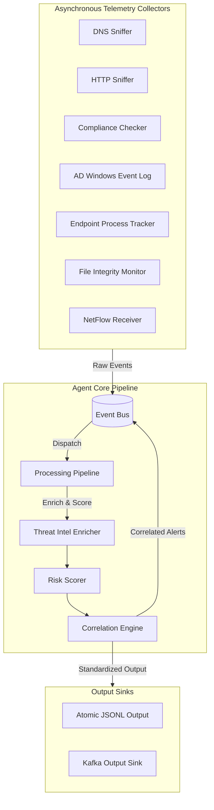

# 🛡️ DeepCytes Unified SOC Agent v2 — Kafka Integration & Telemetry Pipeline

Welcome to the **DeepCytes Unified SOC Agent v2**. This is a production-grade, highly resource-optimized security telemetry agent designed to collect, parse, enrich, score, and correlate telemetry events across 7 security categories inside a single Python process (RAM < 80MB).

---

## 🏛️ Architecture Overview

The agent consists of multiple asynchronous collectors that stream events into an in-memory `EventBus`. Events are processed by a `ProcessingPipeline`, enriched with threat intelligence, correlated across modules in real-time by a `CorrelationEngine`, and published to local output sinks (atomic rotating JSONL logs) and remote **Kafka** broker queues.



---

## 📂 Package Architecture & Module Breakdown

The `deepcytes_soc_agent` core package is structured into clean, decoupled components:

```
deepcytes_soc_agent/
├── agents/          # Orchestrator & processing stack assembly
├── api/             # FastAPI REST server & WebSocket live stream
├── collectors/      # 7 Telemetry engines (DNS, HTTP, AD, Endpoint, FIM, NetFlow, Compliance)
├── config/          # Yaml configuration manager & hot-reload watcher
├── core/            # Standardized schemas (AgentContext, TelemetryEvent, Fingerprint)
├── detectors/       # Threat Intel enrichers & Risk Scoring algorithms
├── dist/            # Standalone pre-built executable binaries (SOC_Agent.exe)
├── event_engine/    # Multi-worker async EventBus for real-time dispatching
├── integrations/    # External integrations & third-party connectors
├── kafka/           # Kafka multi-topic publishing & administrative CLI tools
├── storage/         # Local rotating JSONL sink & SQLite event persistence
└── utils/           # Admin checks, Windows startup registry, logging formatters, path resolvers
```

### 🔍 Detailed Submodule Functions

#### 1. Telemetry Collectors (`collectors/`)
- **`dns_collector.py`**: Sniffs DNS network traffic via Scapy/libpcap to detect DNS tunneling, high-entropy domains, and suspicious TLD accesses.
- **`http_collector.py`**: Integrates mitmproxy hooks to analyze HTTP/HTTPS requests, user-agent anomalies, and malicious file downloads.
- **`ad_collector.py`**: Queries Windows Event Logs (`Security`, `System`) for Active Directory authentications (Logon Events 4624/4625, Privilege Use).
- **`endpoint_collector.py`**: Tracks active process trees (`psutil`), CPU/RAM health metrics, and suspicious execution paths.
- **`fim_collector.py`**: Uses `watchdog` to monitor real-time file creation, deletion, and modification in sensitive system directories.
- **`netflow_collector.py`**: Listens on NetFlow v5 (UDP port 2055) to track network 5-tuples and bandwidth spikes.
- **`compliance_collector.py`**: Audits system security posture (Firewall status, Windows Defender state, UAC settings).

#### 2. Core & Event Processing (`core/`, `event_engine/`, `detectors/`)
- **`event_bus.py`**: Thread-safe in-memory dispatcher with multi-worker pools for ultra-low latency event routing.
- **Threat Intel & Risk Scorer**: Enriches events with IP/domain reputation metrics and assigns risk scores (0–100).
- **Correlation Engine**: Evaluates cross-module anomalies across sliding time windows (e.g., failed logon followed by FIM modification).

---

## 📦 Standalone Executable Deployment (`deepcytes_soc_agent/dist/`)

When deploying on production endpoint machines without Python pre-installed, pre-built Windows standalone executables are located inside `deepcytes_soc_agent/dist/`.

### 🎯 **Recommended Executable: `deepcytes_soc_agent/dist/SOC_Agent.exe`**
- **Executable Path**: `.\deepcytes_soc_agent\dist\SOC_Agent.exe` (Size: ~75.4 MB)
- **Zero Dependencies**: It is a complete, self-contained standalone binary created via PyInstaller. It bundles the Python engine, C-extensions, DLLs, and all third-party libraries (`scapy`, `mitmproxy`, `pyyaml`, `fastapi`, `kafka-python-ng`, `rich`, etc.) into the `.exe` itself.
- **Portability**: No Python or `pip install` required on target machines. Simply copy and execute!

---

## 📊 Kafka Topic Mapping

The agent streams telemetry and alerts to **7 category-specific Kafka topics**:

| Module / Source | Event Category | Target Kafka Topic | Partition Count |
| :--- | :--- | :--- | :--- |
| `dns` | DNS queries and tunneling suspects | `dns-events` | 3 |
| `compliance` | Configuration audits and drift checks | `compliance-events` | 3 |
| `http` | HTTP traffic logs and suspicious downloads | `http-events` | 3 |
| `ad` | Active Directory and logon event logs | `ad-events` | 3 |
| `endpoint` | Process lifecycle and system health metrics | `endpoint-events` | 3 |
| `file_integrity` | File modifications and FIM reputation alerts | `file-integrity-events` | 3 |
| `network` | NetFlow 5-tuples and exfiltration metrics | `network-events` | 3 |

---

## 📋 Standardized Log Format

All event payloads are transformed by the output sinks using `format_to_standard_log` into a unified log layout containing the 7-field **Device Fingerprint** and sequential **Event ID**:

```json
{
  "Device Fingerprint": {
    "Manufacturer": "Dell Inc.",
    "Model": "XPS 15 9520",
    "MAC Address": "A4:FC:77:88:99:AA",
    "IP Address": "192.168.1.150",
    "OS": "Windows 11 Build 22631",
    "username": "secops",
    "Agent-Name": "DeepCytes-SOC-Agent-v2"
  },
  "Timestamp": "2026-06-26T12:00:00.000Z",
  "Event ID": "DNS0005",
  "Event Type": "DNS_TUNNELING_SUSPECT",
  "Severity / Criticality": "HIGH",
  "Payload / Message": {
    "event_id": "90e0b3e5-829d-4351-a957-6e69318b80fc",
    "source_module": "dns",
    "event_type": "DNS_TUNNELING_SUSPECT",
    "event_category": "alert",
    "severity": "HIGH",
    "payload": {
      "query_name": "ajfhusdhufhsuifh.c2.threat.com",
      "query_type": "TXT"
    }
  }
}
```

---

## ⚙️ Configuration Schema (`config.yaml`)

Telemetry collectors and outputs are configured centrally inside `config.yaml`:

```yaml
agent:
  id: "deepcytes-prod-agent-1"
  name: "DeepCytes-SOC-Agent-v2"
  version: "2.0.0"

collectors:
  dns:
    enabled: true
    interface: "\\Device\\NPF_Loopback"
  ad:
    enabled: true
    poll_interval_seconds: 5.0
  endpoint:
    enabled: true
    poll_interval_seconds: 10.0
    health_snapshot_interval_seconds: 60.0
  file_integrity:
    enabled: true
    watch_paths: ["C:\\Windows\\System32\\drivers\\etc"]
  network:
    enabled: true
    netflow_port: 2055

outputs:
  json:
    enabled: true
    file_path: "logs/soc_events.jsonl"
  kafka:
    enabled: true
    bootstrap_servers: ["localhost:9092"]
    topics:
      dns: "dns-events"
      compliance: "compliance-events"
      http: "http-events"
      ad: "ad-events"
      endpoint: "endpoint-events"
      file_integrity: "file-integrity-events"
      network: "network-events"
```

---

## 🚀 Getting Started

### 1️⃣ Start Kafka (KRaft mode)
Navigate to your Kafka directory and start the broker on port `9092`:
```powershell
# Format log directory
.\bin\windows\kafka-storage.bat format -t <YOUR_UUID> -c .\config\server.properties
# Start broker
.\bin\windows\kafka-server-start.bat .\config\server.properties
```

### 2️⃣ Initialize Telemetry Topics
Create all 7 topics in one execution:
```powershell
python -m deepcytes_soc_agent.kafka_admin create --all
```

### 3️⃣ Run the Agent

**Option A: Running via Python**
```powershell
python main.py
```

**Option B: Running Standalone Executable (Recommended for Production)**
Deploy and execute the standalone compiled binary:
```powershell
.\deepcytes_soc_agent\dist\SOC_Agent.exe
```

### 4️⃣ Install as Windows Service / Auto-Start
- **Register for Auto-Start on Boot**:
  ```powershell
  .\deepcytes_soc_agent\dist\SOC_Agent.exe --register-startup
  ```
- **Install as a Windows Service (via NSSM)**:
  ```powershell
  powershell -ExecutionPolicy Bypass -File .\packaging\install_service.ps1
  ```

---

## 🧪 Test Suite

Run the full automated test suite to validate schema formatting, fingerprint resolution, routing, and correlation rules:
```powershell
python -m pytest tests/ -v
```
