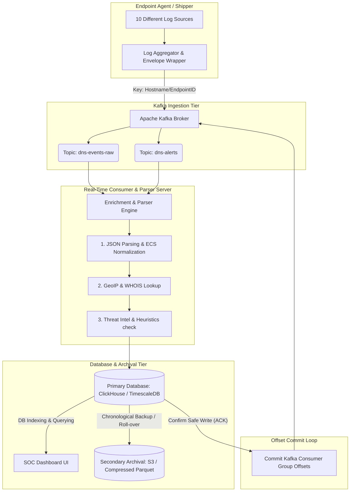

# Real-Time SOC Log Ingestion & Processing Pipeline (Kafka & DB Integration)

This document provides a theoretical implementation plan and architecture design for building a Security Operations Center (SOC) telemetry ingestion pipeline. It addresses endpoint log collection, real-time serialization, Kafka topic and partitioning strategies, real-time stream formatting, consumer checkpointing (fault tolerance), and long-term archival storage.

---

## 1. Data Ingestion Architecture & Ingestion Flow

Below is a Mermaid diagram demonstrating how log data flows from the endpoints through Apache Kafka, gets processed/enriched in real time, and is saved into the database and cold storage.



---

## 2. Theoretical Answers to the 9 Core Architecture Questions

### Question 1: Ingesting 10 Different Logs Collected for a Single Endpoint
To handle 10 different log types (e.g., DNS queries, process creations, network sockets, logins, file activities, registry changes, system metrics, audit events, firewall denials, and security alerts) from a single endpoint:
- **Unified Agent Wrapper**: A local agent (like a custom daemon/service, Filebeat, Vector, or FluentBit) runs on the endpoint.
- **Log Envelope**: Each raw log event is serialized into a standard JSON metadata envelope before leaving the host. This envelope attaches global endpoint contexts so logs can be correlated.

---

### Question 2: Handling Log Subtypes, Details, and Depths
We use a **hierarchical structured schema** (using JSON, Apache Avro, or Protocol Buffers) to support nested details without breaking the schema structure:
- **Global Envelope**: Contains general metadata.
- **Data Object**: Contains a specific payload matching the log subtype.
- **Enrichments Object**: Contains deep analysis results (e.g., DGA confidence score, entropy rating, threat feed matches).

**Sample Log Payload Wrapper:**
```json
{
  "event_id": "a4b1c2d3-e4f5-6789-0123-456789abcdef",
  "timestamp": "2026-06-13T04:22:04Z",
  "log_type": "DNS",
  "log_subtype": "QUERY",
  "endpoint_id": "SOC-ANALYST-W11",
  "session_user": "rishik_admin",
  "data": {
    "query": "ztvnhmhm4zj95w3.xyz",
    "query_type": "A",
    "response_code": "NXDOMAIN",
    "ttl": 10,
    "details": {
      "subdomain_length": 15,
      "entropy": 4.12
    }
  },
  "process": {
    "pid": 4096,
    "process_name": "cmd.exe",
    "parent_pid": 1024,
    "command_line": "ping ztvnhmhm4zj95w3.xyz"
  },
  "enrichment": {
    "geoip": [],
    "threat_intel": {
      "is_malicious": true,
      "threat_category": "PLASMAGRID C2",
      "source": "Google Threat Intel"
    },
    "alerts": ["DGA_DETECTED", "THREAT_INTEL_MATCH"]
  }
}
```

---

### Question 3: Out-of-Order / Delayed Log Arrival
Because of network latencies, offline endpoints, or local buffers, logs may not arrive in chronological order. We resolve this by tracking **three distinct timestamps** in each record:
1. `event_time` (UTC timestamp when the event actually happened on the endpoint).
2. `ingest_time` (UTC timestamp when the Kafka broker received the event).
3. `process_time` (UTC timestamp when the consumer database writer processed the event).

**Handling Strategies:**
- **Database Ordering**: We index and partition our database on `event_time` so queries reflect the true timeline of events.
- **Watermarking / Windowing**: When performing correlation checks across logs (e.g., correlating a file write with a DNS query), stream processing frameworks (like Flink or Kafka Streams) use **Watermarks** to wait a predefined grace period for delayed logs before closing analysis windows.

---

### Question 4: Storing Log Data Effectively
To support fast writes and rapid searches:
- **Columnar Time-Series DB (ClickHouse / TimescaleDB)**: Highly effective for structured security events. ClickHouse provides compression ratios of 5x–10x and fast querying over billions of logs.
- **Index Optimization**: We primary-key index the logs on `(event_time, endpoint_id, log_type)`. This matches the typical SOC query patterns ("Show me all DNS logs for host X in the last 2 hours").
- **No Raw Text Indexes**: We parse raw strings into structured fields. Rather than storing a whole message as text, we store variables in separate columns, saving CPU and storage overhead during filters.

---

### Question 5: Fault Tolerance & Offset Management (Crash Recovery)
To guarantee that a consumer picks up exactly where it crashed without losing or duplicating data:
1. **Disable Auto-Commits**: Set `enable.auto.commit = False` in the Kafka Consumer config.
2. **Post-Write Commit Protocol**:
   - The consumer pulls a batch of messages.
   - The consumer parses, formats, and batch-inserts the records into the database.
   - Once the database returns a successful write acknowledgment (ACK), the consumer issues a **manual synchronous commit** (`consumer.commit()`) to Kafka.
3. **Idempotent Storage**: To avoid duplicate entries in the database during consumer crash-recovery replays, the database table uses the log's unique `event_id` as a primary key or deduplication key. If Kafka replays a batch, the database safely ignores or updates duplicates.

---

### Question 6: Real-Time Formatting and Enrichment (No Raw Storage)
Raw logs are parsed and formatted **in-stream** inside the consumer service *before* entering the database:
- **Parser Stage**: Extract raw text lines using regular expressions or schema definitions and convert them into Python/Go objects.
- **Taxonomy Normalization**: Map fields to a unified naming scheme (e.g., standardizing `ip_address`, `source_ip`, `src_ip` all to `src_ip`).
- **Enrichment Hook**: Execute cache-backed checks:
  - *GeoIP*: Query a local MaxMind database cache.
  - *Threat Intel*: Match fields against a high-speed memory-cache (Redis/local dictionaries) populated with threat feeds.
  - *Heuristics*: Run entropy calculations and DGA algorithms.
- **Final Write**: The resulting structured document is written to the DB.

---

### Question 7: Retention Policy and Archival Storage
We implement an Index Lifecycle Management (ILM) flow with three tiers:
- **Hot Tier (0 - 15 Days)**: Stored in the primary database (ClickHouse/Elasticsearch) on fast SSDs. Instant queries.
- **Warm Tier (16 - 90 Days)**: Compressed database tables stored on slower HDDs. Good for historical threat hunting.
- **Cold Tier (90+ Days)**: An automated daily cron job or database routine exports old logs as compressed **Parquet files** to secondary storage (e.g., MinIO or AWS S3 Glacier). These files are highly compressed and can still be queried via tools like Athena or DuckDB if needed.

---

### Question 8: Kafka Topic & Partition Design
**Topics List:**
To simplify infrastructure and ingest telemetry from all 10 sources efficiently, we use exactly **two topics**:
- `dns-events-raw`: General/benign telemetry logs for all 10 source types.
- `dns-alerts`: Real-time threat/alert findings generated when heuristics, threat intelligence matching, or anomaly rules trigger.

**Partitioning & Routing Key Strategy:**
- **Topic Partitions**: Set each topic to **3 partitions** (matching the local testing configurations).
- **Partitioning Key**: We use the **`endpoint_id` (or `hostname`)** as the record key (passed to `KafkaProducer.send(topic, key=endpoint_id, value=...)`).
- **Partitioning Logic**: Kafka hashes the key (`MurmurHash2`) to select the partition:
  $$\text{Partition} = \text{Hash}(key) \pmod{\text{Total Partitions}}$$
  By keying on `endpoint_id`, all logs from a single machine are guaranteed to route to the **same partition**. Since a single partition is processed in-order by a single consumer thread, this preserves chronological ordering for temporal analysis on that host.

---

### Question 9: Data Points Sent to Kafka (Data Schema Diagram)

This structured data model is generated on the endpoint and sent to the broker:

```
┌────────────────────────────────────────────────────────────────────────┐
│                      KAFKA MESSAGE ENVELOPE                            │
├────────────────────────────────────────────────────────────────────────┤
│ KEY: "SOC-ANALYST-W11" (Endpoint/Hostname - enforces partition order) │
├────────────────────────────────────────────────────────────────────────┤
│ VALUE (JSON PAYLOAD):                                                 │
│                                                                        │
│  ┌─ SYSTEM METADATA ────────────────────────────────────────────────┐  │
│  │ event_id       : UUIDv4 string (e.g. "a4b1c2d3-e4f5...")         │  │
│  │ timestamp      : ISO8601 string (event_time)                      │  │
│  │ log_type       : String ("DNS", "PROCESS", "NETWORK")            │  │
│  │ log_subtype    : String ("QUERY", "CREATION", "ESTABLISHED")     │  │
│  └──────────────────────────────────────────────────────────────────┘  │
│                                                                        │
│  ┌─ TELEMETRY PAYLOAD (Dynamic based on Log Type) ──────────────────┐  │
│  │  [If DNS]                                                        │  │
│  │  query         : String ("ztvnhmhm4zj95w3.xyz")                  │  │
│  │  query_type    : String ("A", "AAAA", "TXT")                     │  │
│  │  ttl           : Integer (Time to Live value)                    │  │
│  │                                                                  │  │
│  │  [If PROCESS]                                                    │  │
│  │  pid           : Integer (Process ID)                            │  │
│  │  process_name  : String ("cmd.exe")                              │  │
│  │  command_line  : String ("ping malicious-domain.com")            │  │
│  └──────────────────────────────────────────────────────────────────┘  │
│                                                                        │
│  ┌─ HOST & USER IDENTITY CONTEXT ───────────────────────────────────┐  │
│  │  hostname      : String ("SOC-ANALYST-W11")                      │  │
│  │  os_version    : String ("Windows 11 Enterprise")                │  │
│  │  username      : String ("rishik_admin")                         │  │
│  │  privilege     : String ("Administrator")                        │  │
│  └──────────────────────────────────────────────────────────────────┘  │
└────────────────────────────────────────────────────────────────────────┘
```

---

## 3. Step-by-Step Instructions to Set Up and Test the Kafka Ingestion Pipeline

To validate your producer and setup the consumers locally using Windows and Python, use the following sequence of commands.

### Phase A: Start the Apache Kafka Environment (Windows KRaft)
If your Kafka directory is located at `C:\kafka_2.13-4.3.0`, open a command prompt (`cmd`) and execute:

1. **Format Log Directories**:
   ```cmd
   cd C:\kafka_2.13-4.3.0
   .\bin\windows\kafka-storage.bat format -t LSn9dWs_RQmd9SNvmYxqeQ -c .\config\server.properties --standalone
   ```

2. **Start the Single-Node KRaft Broker** (leave this terminal open):
   ```cmd
   .\bin\windows\kafka-server-start.bat .\config\server.properties
   ```

---

### Phase B: Configure and Verify Topics
Open a **new terminal** to create the log topics with the partitioning strategy:

1. **List Existing Topics** (Check connection):
   ```cmd
   .\bin\windows\kafka-topics.bat --bootstrap-server localhost:9092 --list
   ```

2. **Create Ingestion Topics** (3 partitions each to support scalable consumer groups):
   ```cmd
   .\bin\windows\kafka-topics.bat --create --topic dns-events-raw --bootstrap-server localhost:9092 --partitions 3 --replication-factor 1
   ```
   ```cmd
   .\bin\windows\kafka-topics.bat --create --topic dns-alerts --bootstrap-server localhost:9092 --partitions 3 --replication-factor 1
   ```

---

### Phase C: Start Client Observers (Console Consumers)
Open **two separate command prompts** to monitor events as they arrive:

- **Terminal 1: Watch Benign Events**
  ```cmd
  cd C:\kafka_2.13-4.3.0
  .\bin\windows\kafka-console-consumer.bat --topic dns-events-raw --bootstrap-server localhost:9092 --property print.key=true --property key.separator=" | "
  ```

- **Terminal 2: Watch Security Alerts**
  ```cmd
  cd C:\kafka_2.13-4.3.0
  .\bin\windows\kafka-console-consumer.bat --topic dns-alerts --bootstrap-server localhost:9092 --property print.key=true --property key.separator=" | "
  ```

---

### Phase D: Run the Producer Agent
1. Verify that your configuration settings in `config.py` have the integration enabled:
   ```python
   KAFKA_ENABLED = True
   KAFKA_BOOTSTRAP_SERVERS = ["localhost:9092"]
   KAFKA_TOPIC_RAW = "dns-events-raw"
   KAFKA_TOPIC_ALERTS = "dns-alerts"
   ```
2. Run your Python agent in your workspace directory:
   ```cmd
   python main.py
   ```
3. Watch the logs route in real-time. Events mapped as benign will stream into the first consumer console window, while flagged threat intelligence matches or DGA alerts will route to the alerts console.
